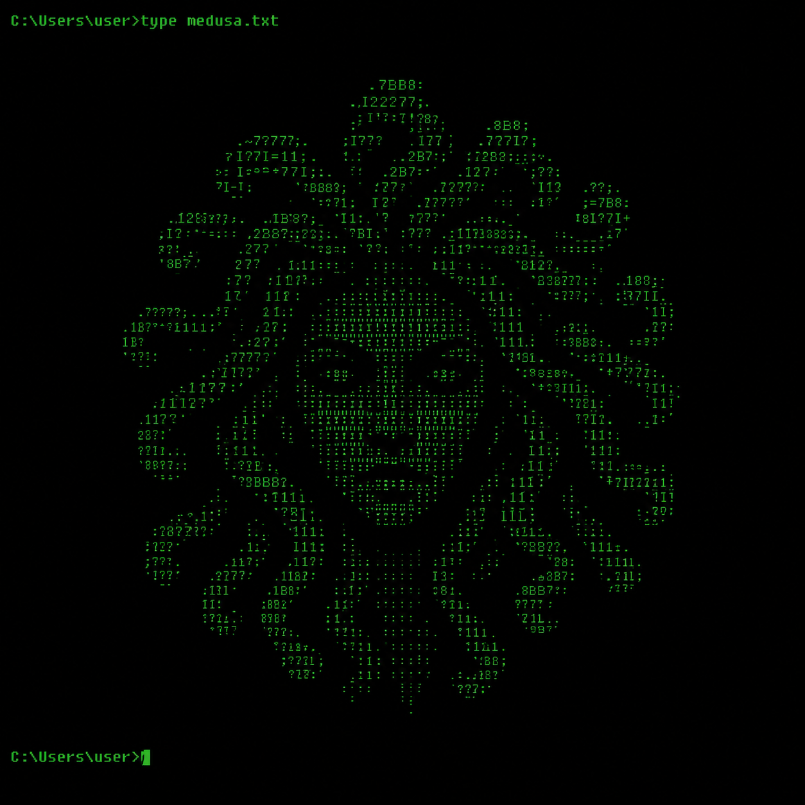
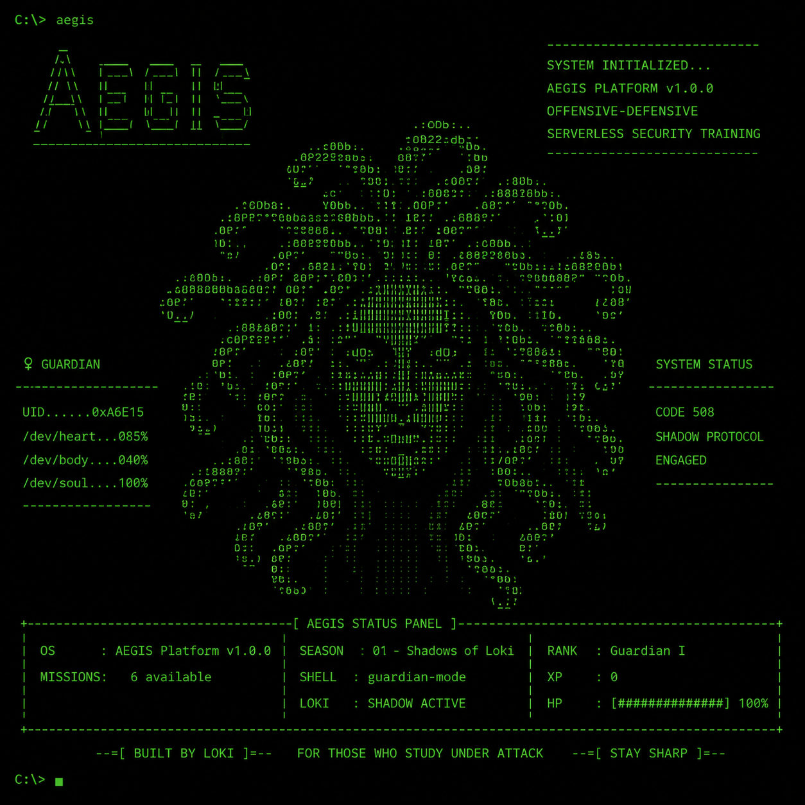

<div align="center">

  <p align="center">
  
</p>

**Gamified real-time serverless security training platform.**


</div>

---

## `// What is ÆGIS?`



> *ÆGIS was the legendary shield carried by Athena. Embedded with Medusa's head, it could paralyze anyone who dared face it.*

ÆGIS is a gamified offensive-defensive cybersecurity training platform focused on serverless environments.

Instead of passive lessons and static quizzes, an active APT known as **Loki's Shadows** attacks the player in real time using realistic payloads while they study.

<br clear="left"/>

```
▸ Command Injection        ▸ SSRF
▸ IDOR                     ▸ Supply Chain Attacks
▸ Broken Authentication    ▸ Privilege Escalation
▸ Cloud attack vectors     ▸ Defensive mitigation strategies
```

Under pressure.

---

## `// Why ÆGIS?`



Most learning platforms separate theory from practice.

ÆGIS does the opposite.

While reading documentation, solving missions, or reviewing study material, the platform continuously launches simulated attacks against the player.

<br clear="right"/>
<br/>

```
OBJECTIVES
──────────────────────────────────────
→ real pressure
→ faster pattern recognition
→ offensive-defensive thinking
→ practical security instincts
```

You are not preparing for attacks. **You survive them while learning.**

---

## `// Core Mechanics`

| SYS | MODULE | DESCRIPTION |
|-----|--------|-------------|
| `☽` | **Loki's Shadows** | Real-time attack engine with adaptive escalation |
| `⊞` | **Mission System** | Progressive security scenarios with vulnerable code and defensive fixes |
| `⚡` | **Flashcards** | Mission-based spaced repetition system |
| `▣` | **Simulations** | Timed security exams and challenge modes |
| `◈` | **Study Module** | Field files, theory, payload analysis, and code walkthroughs |
| `✦` | **Leaderboard** | Real-time global ranking powered by Supabase |
| `◈` | **ÆGIS-BOT** | Context-aware AI tutor |
| `☠` | **Loki** | Dynamic taunts and adaptive attack behavior |

---

## `// Loki's Shadows — Escalation System`

Loki dynamically scales attack intensity according to the active mission.

```
MISSION   THEME                INTERVAL    TIMER   BURST
─────────────────────────────────────────────────────────────
01        Command Injection    30–45s      15s     —
02        IDOR                 22–35s      13s     —
03        Broken Auth          16–28s      11s     15% double
04        SSRF                 12–22s       9s     25% double
05        Supply Chain          9–16s       8s     35% double
06        Final APT             7–13s       7s     50% triple  ◀ MAX
```

**Thematic payload examples:**

```
→ IDOR          object access manipulation
→ Broken Auth   forged JWT payloads
→ SSRF          AWS metadata exploitation
→ Supply Chain  poisoned dependencies
```

**Attack distribution:**

```
70%  mission-specific attacks
30%  global attack pool
```

```
// every blocked attack  →  +XP  +HP recovery
// every mistake         →  ÆGIS shield damage
// HP reaches 0%         →  system collapse
```

---

## `// Mission Structure`

Each mission contains:

```
[1] Vulnerable scenario
[2] Attack explanation
[3] Defensive implementation
[4] Final checkpoint
```

| MISSION | THEME |
|---------|-------|
| Mission 01 | Command Injection |
| Mission 02 | IDOR |
| Mission 03 | Broken Authentication |
| Mission 04 | SSRF |
| Mission 05 | Supply Chain |
| Mission 06 | Final APT |

---

## `// ÆGIS-BOT`

The platform includes a contextual AI tutor capable of understanding:

```
→ active section
→ mission progress
→ player HP
→ guardian level
→ current challenge state
```

Common topics are answered locally with **near-zero latency**.

---

## `// XP System`

All progression flows through:

```javascript
window._grantXP({
  xp:     60,
  hp:     -20,
  blocks: 1,
  fails:  1,
  label:  'missions:loki',
});
```

| EVENT | RESULT |
|-------|--------|
| Block Loki attack | `+XP` `+HP recovery` |
| Complete mission | `Massive XP reward` |
| Correct simulation answer | `+XP` |
| Fail defense | `-HP` |
| Timeout | `Critical HP damage` |

---

## `// Architecture`

```
ÆGIS/
├── index.html
├── main.js
├── style.css
├── config.js
└── js/
    ├── ai-router.js
    ├── missions-attacks.js
    ├── missions-data.js
    ├── missions-ui.js
    ├── personalities.js
    ├── estudos.js
    ├── estudos_content.js
    ├── ranking.js          ← STATE wrapped in Proxy → auto Supabase sync
    ├── nick-screen.js
    └── aegis-mobile-nav.js
```

---

## `// Stack`

```
Frontend   →  HTML + CSS + Vanilla JavaScript
Backend    →  Node.js + Express
Database   →  PostgreSQL (Supabase)
Auth       →  Supabase Auth
Deploy     →  Netlify / Vercel / GitHub Pages
Build      →  No bundlers / zero dependencies
```


---

## `// Dependencies`

```
express       ^4.18.2   →  HTTP server
cors          ^2.8.5    →  Cross-origin requests
dotenv        ^16.4.5   →  Environment variables
node-fetch    ^2.7.0    →  Server-side fetch
nodemon       ^3.1.0    →  Dev auto-reload
```

---

## `// Local Setup`

```bash
# install dependencies
npm install

# run dev server
npm run dev

# run production
npm start
```

```
http://localhost:3000
```

---

## `// Supabase Configuration`

```javascript
const SUPABASE_URL = 'your-url';
const SUPABASE_KEY = 'your-key';
```

---

## `// Console Commands`

```javascript
launchAttack();

window._grantXP({ xp: 500, hp: 50 });

window.STATE.aegisHp = 0;
triggerAegisDeath();

onMissionCompleted(1, 200);

navigate('ranking');

console.log(window.STATE);
```

---

## `// Roadmap`

**Current**

- [x] Real-time Loki attacks
- [x] Dynamic escalation system
- [x] Thematic payload engine
- [x] 6 progressive missions
- [x] Flashcard system
- [x] Study module
- [x] AI tutor integration
- [x] Real-time leaderboard
- [x] Mobile responsive layout
- [x] Guardian login screen

**Planned**

- [ ] Full simulation question bank
- [ ] PvP guardian mode
- [ ] Offline PWA support
- [ ] Seasonal events
- [ ] Cooperative defense mode
- [ ] Community missions
- [ ] Season 02

---

## `// Philosophy`

```
Security is not learned passively.

Recognition comes from exposure.
Instinct comes from repetition.
Discipline comes from pressure.

ÆGIS was built to simulate that pressure.
```

---

## `// License`

Distributed under the [MIT License](LICENSE).

---

<div align="center">

```
> LOKI'S SHADOWS IS MONITORING THIS FREQUENCY
> 01000111 01110101 01100001 01110010 01100100 01101001
> Guardian — ÆGIS depends on you
```

[↑ back to top](#)

</div>
